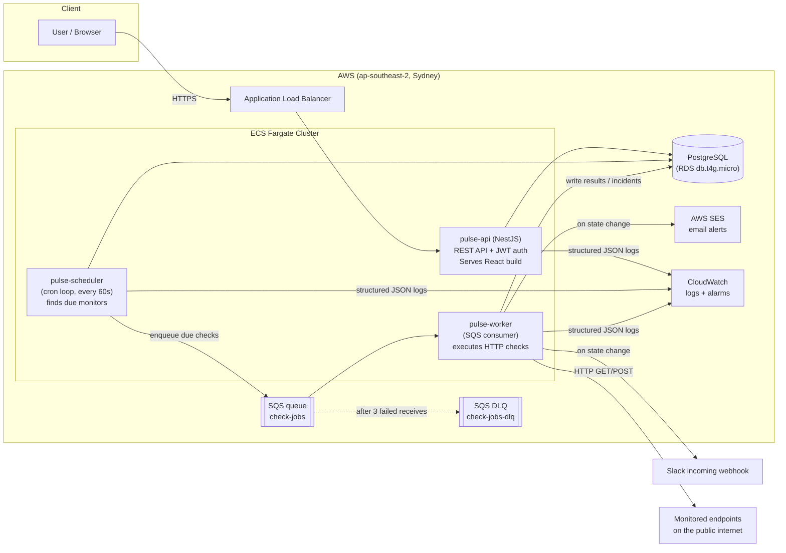
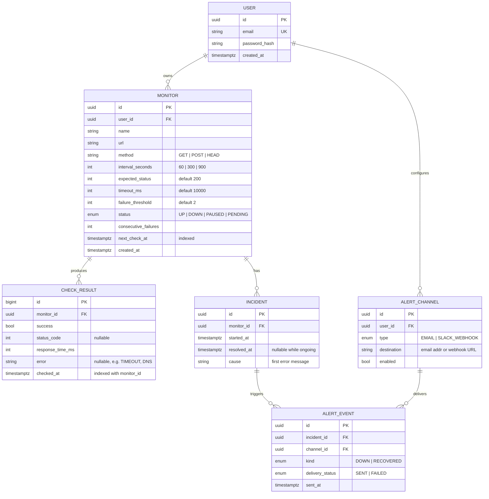
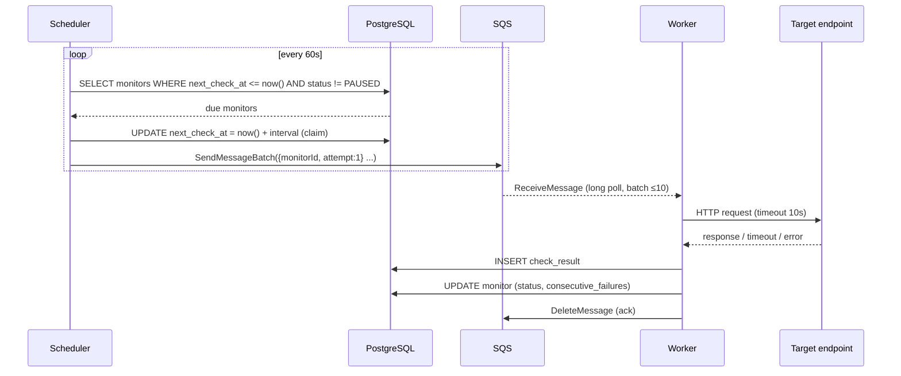
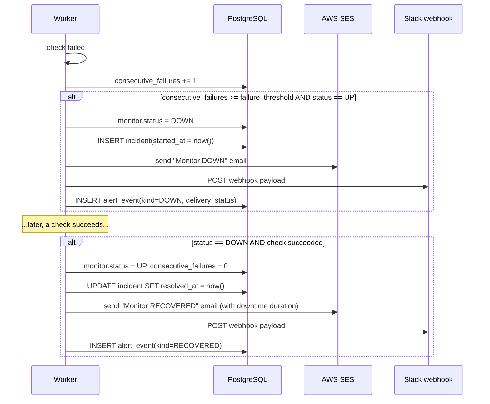
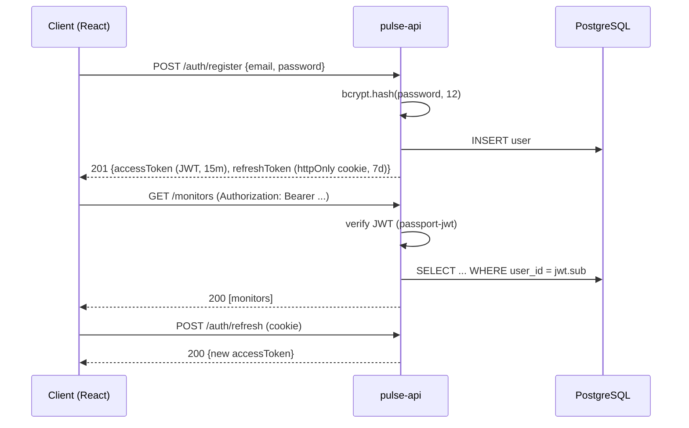
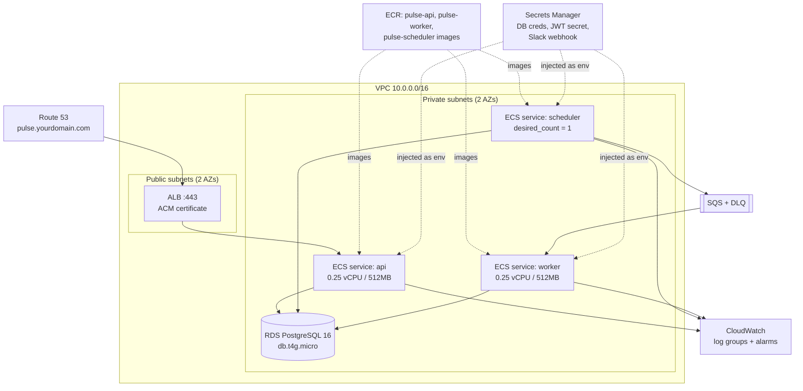
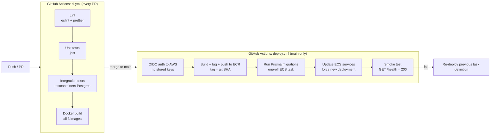

# Pulse — Uptime & API Monitoring Service

A self-hosted uptime monitoring and alerting platform. Users register HTTP endpoints; Pulse checks them on schedule, records response time and status, visualises uptime on a dashboard, and sends alerts (email + Slack) when endpoints go down or recover.

**Live demo:** `Coming Soon` 

**Stack:** NestJS · PostgreSQL · AWS (ECS Fargate, SQS, SES, ECR, CloudWatch) · Terraform · GitHub Actions · React

> **Why this project exists:** built to demonstrate production-grade backend and cloud engineering — async job processing, infrastructure as code, CI/CD, and observability — not as a product. Every design decision is documented in [Design Decisions](#9-design-decisions).

---

## Table of Contents

1. [Features (MVP scope)](#1-features-mvp-scope)
2. [System Architecture](#2-system-architecture)
3. [Data Model](#3-data-model)
4. [Core Flows (Sequence Diagrams)](#4-core-flows-sequence-diagrams)
5. [AWS Infrastructure](#5-aws-infrastructure)
6. [CI/CD Pipeline](#6-cicd-pipeline)
7. [Repository Structure](#7-repository-structure)
8. [API Specification](#8-api-specification)
9. [Design Decisions](#9-design-decisions)
10. [Local Development](#10-local-development)
11. [Configuration](#11-configuration)
12. [Delivery Plan & Milestones](#12-delivery-plan--milestones)
13. [Out of Scope (Deliberately)](#13-out-of-scope-deliberately)
14. [Future Improvements](#14-future-improvements)

---

## 1. Features (MVP scope)

| # | Feature | Description |
|---|---------|-------------|
| F1 | **Auth** | Register / login with email + password, JWT access tokens, bcrypt hashing |
| F2 | **Monitors CRUD** | Create/update/pause/delete a monitor: target URL, HTTP method, check interval (1/5/15 min), expected status code, timeout |
| F3 | **Scheduled checks** | A scheduler enqueues due checks; a worker executes them and records status, latency, and error detail |
| F4 | **Incident detection** | A monitor transitions UP → DOWN after N consecutive failures (default 2) and DOWN → UP on first success; each outage is recorded as an incident with duration |
| F5 | **Alerting** | On DOWN and on RECOVERY: email (AWS SES) and Slack (incoming webhook) notifications |
| F6 | **Dashboard** | Per-monitor uptime % (24h / 7d / 30d), response-time chart, incident history |

**Definition of done for MVP:** all six features working on the live AWS deployment, deployed exclusively through the CI/CD pipeline (no manual deploys), with CloudWatch alarms on the worker queue.

---

## 2. System Architecture



**Three deployable services, one repo (monorepo):**

| Service | Responsibility | Scales on |
|---|---|---|
| `pulse-api` | REST API, auth, serves dashboard | HTTP traffic |
| `pulse-scheduler` | Every 60s: query monitors due for a check, enqueue one SQS message per check. Single instance. | n/a (singleton) |
| `pulse-worker` | Consume SQS, run the HTTP check, persist result, detect state transitions, fire alerts | Queue depth |

Separating scheduler → queue → worker is the core architectural demonstration: checks are executed asynchronously, retried safely, and the worker can scale horizontally without double-checking the same monitor.

---

## 3. Data Model



**Indexing notes:**

- `monitor(next_check_at) WHERE status NOT IN ('PAUSED')` — partial index; the scheduler's only query.
- `check_result(monitor_id, checked_at DESC)` — composite index serving the dashboard chart and uptime aggregation.
- `check_result` is the high-volume table (~1 row per check). At MVP scale Postgres is fine; the scale-up path is ClickHouse or Timescale (see Design Decisions).
- A retention job deletes `check_result` rows older than 30 days (Postgres `pg_cron` or a scheduled worker task).

---

## 4. Core Flows (Sequence Diagrams)

### 4.1 Scheduled check execution



> The scheduler **claims** monitors by advancing `next_check_at` before enqueueing, so a crashed scheduler restart never double-enqueues, and the worker stays idempotent.

### 4.2 Incident detection and alerting



### 4.3 Auth flow



---

## 5. AWS Infrastructure

All infrastructure is defined in Terraform under `infra/`. Nothing is created in the console.



**Terraform layout:**

```
infra/
├── main.tf            # providers, backend (S3 state + DynamoDB lock)
├── vpc.tf             # VPC, subnets, NAT-less design (see decisions), security groups
├── ecs.tf             # cluster, 3 task definitions, 3 services
├── alb.tf             # ALB, target group, HTTPS listener, ACM
├── rds.tf             # PostgreSQL instance, subnet group, parameter group
├── sqs.tf             # queue + DLQ + redrive policy
├── ecr.tf             # 3 repositories with lifecycle policy (keep last 10 images)
├── iam.tf             # task roles (least privilege: worker → SQS+SES, api → none)
├── cloudwatch.tf      # log groups, alarms (see below)
├── secrets.tf         # Secrets Manager entries
├── route53.tf         # DNS records
├── variables.tf
└── outputs.tf
```

**CloudWatch alarms (the "observability of the observer" layer):**

| Alarm | Condition | Action |
|---|---|---|
| `worker-queue-backlog` | SQS `ApproximateNumberOfMessagesVisible` > 100 for 5 min | SNS → email |
| `dlq-not-empty` | DLQ messages > 0 | SNS → email |
| `api-5xx` | ALB 5xx count > 10 in 5 min | SNS → email |
| `rds-cpu` | CPU > 80% for 10 min | SNS → email |

**Estimated monthly cost:** ~AUD $0–15 in the first 12 months (free tier covers Fargate partially, RDS t4g.micro, SQS, SES sandbox).

---

## 6. CI/CD Pipeline



**Pipeline rules:**

- `main` is protected; merges only via PR with green CI.
- Deploys use **GitHub OIDC → AWS IAM role** (no long-lived AWS keys in GitHub secrets — mention this in interviews, it's current best practice).
- Image tags are git SHAs, never `latest`, so rollback = redeploy previous task definition.
- Database migrations run as a one-off ECS task *before* service update.

---

## 7. Repository Structure

```
pulse/
├── CLAUDE.md                  # Claude Code project guide
├── README.md                  # this document
├── docker-compose.yml         # local: postgres + localstack(sqs) + all services
├── package.json               # npm workspaces root
├── apps/
│   ├── api/                   # NestJS REST API
│   │   ├── src/
│   │   │   ├── auth/          # module: controller, service, jwt strategy, guards
│   │   │   ├── monitors/      # module: CRUD + uptime stats endpoint
│   │   │   ├── incidents/     # module: read-only incident history
│   │   │   ├── alert-channels/
│   │   │   ├── health/        # GET /health for ALB + smoke test
│   │   │   └── main.ts
│   │   ├── test/
│   │   └── Dockerfile
│   ├── scheduler/             # small Node service (NestJS standalone app)
│   │   ├── src/scheduler.service.ts
│   │   └── Dockerfile
│   ├── worker/                # SQS consumer (NestJS standalone app)
│   │   ├── src/
│   │   │   ├── checker/       # http check execution
│   │   │   ├── incidents/     # state machine: UP/DOWN transitions
│   │   │   └── alerts/        # ses.sender.ts, slack.sender.ts
│   │   └── Dockerfile
│   └── web/                   # React dashboard (Vite)
│       └── src/
├── packages/
│   ├── db/                    # Prisma schema + client (shared)
│   │   └── prisma/schema.prisma
│   └── shared/                # DTOs, types, constants shared across apps
├── infra/                     # Terraform (see section 5)
└── .github/workflows/
    ├── ci.yml
    └── deploy.yml
```

---

## 8. API Specification

| Method | Path | Auth | Description |
|---|---|---|---|
| POST | `/auth/register` | — | Create account |
| POST | `/auth/login` | — | Returns JWT + refresh cookie |
| POST | `/auth/refresh` | cookie | New access token |
| GET | `/monitors` | JWT | List user's monitors with current status + 24h uptime |
| POST | `/monitors` | JWT | Create monitor (validated: URL, interval ∈ {60,300,900}) |
| GET | `/monitors/:id` | JWT | Monitor detail |
| PATCH | `/monitors/:id` | JWT | Update / pause / resume |
| DELETE | `/monitors/:id` | JWT | Delete (cascades results + incidents) |
| GET | `/monitors/:id/results?from&to&bucket` | JWT | Time-bucketed response times for charting |
| GET | `/monitors/:id/uptime?window=24h\|7d\|30d` | JWT | Uptime percentage |
| GET | `/monitors/:id/incidents` | JWT | Incident history |
| GET | `/alert-channels` / POST / DELETE | JWT | Manage email/Slack channels |
| GET | `/health` | — | Liveness: returns 200 + DB connectivity |

All endpoints validated with `class-validator` DTOs; errors follow a consistent `{statusCode, message, error}` envelope. OpenAPI spec auto-generated at `/docs` via `@nestjs/swagger`.

---

## 9. Design Decisions


1. **SQS over RabbitMQ.** I've run RabbitMQ in production; here I chose SQS because it's fully managed, free at this scale, and gives DLQ + redrive out of the box. Trade-off: no fan-out/routing semantics — acceptable because there is exactly one consumer type. RabbitMQ remains the right choice when you need exchanges, priorities, or on-prem.
2. **Scheduler claims work by advancing `next_check_at` before enqueueing.** Makes enqueueing idempotent across scheduler restarts and avoids distributed locking. Trade-off: a crash between claim and enqueue skips one check cycle — acceptable for monitoring (next cycle catches it) vs. the complexity of transactional outbox.
3. **Postgres for time-series at MVP scale.** One row per check ≈ 1.4k rows/day per 1-minute monitor. With a composite index and 30-day retention this is trivial for Postgres. Scale-up path: ClickHouse (which I used for this exact workload at O3) or Timescale. Don't add that infra before the data volume justifies it.
4. **Three services, one monorepo.** Separate deployables demonstrate service separation and independent scaling; the monorepo with npm workspaces + a shared Prisma package keeps DX simple and types consistent.
5. **Fargate over EC2/Kubernetes.** No cluster to manage, per-task IAM roles, free-tier friendly. Kubernetes would be résumé-driven over-engineering at this scale — and saying so is the stronger interview answer.
6. **OIDC deploy auth, no stored AWS keys.** GitHub's OIDC provider assumes a scoped IAM role at deploy time. Eliminates the most common CI credential-leak risk.
7. **JWT (15 min) + httpOnly refresh cookie.** Short-lived access token limits blast radius; refresh token never exposed to JS.
8. **Prisma 7 with a driver adapter (`@prisma/adapter-pg`).** Prisma 7 removes the schema-level connection URL: the CLI/Migrate reads it from `packages/db/prisma.config.ts`, and the runtime `PrismaClient` connects through a Postgres driver adapter passed to its constructor. The adapter (`@prisma/adapter-pg` + `pg`) is confined to `packages/db`, which exposes a `createPrismaAdapter()` factory so the apps depend only on `@pulse/db`. Trade-off: a little more wiring than the old single-URL config, in exchange for being on the supported, current major version and the standard Rust-free query path.
9. **Dependency-light frontend with a swappable mock-data layer.** The dashboard is hand-built React + a single CSS design system (no UI framework), keeping the bundle small and the styling fully owned; `lucide-react` is the only UI dependency (icons). All data is served from `apps/web/src/lib/mock.ts`, behind the same shapes the API returns (README §8), so wiring the real API later is a matter of swapping that one module for `axios` calls. Auth and theme are React contexts persisted to `localStorage`. Trade-off: writing our own components/CSS costs more upfront than adopting a kit, but it avoids design-system lock-in and demonstrates the styling fundamentals.
10. **Incident state machine: a pure decision + a transactional, status-guarded apply.** The UP↔DOWN logic is split into a side-effect-free `decideIncidentTransition()` (exhaustively unit-tested: threshold boundaries, flapping, recovery, pending) and a service that applies the decision inside one Prisma transaction. The monitor row is locked `FOR UPDATE`, so concurrent workers and at-least-once SQS redeliveries serialise — only one can perform a transition, the rest see the already-updated status and no-op. This is what makes duplicate deliveries safe: check results may duplicate harmlessly, but incidents and alerts never double-fire. Alerts are sent only *after* the transaction commits, so a slow/failed delivery never holds the lock, and each delivery is recorded as an `alert_event` (`SENT`/`FAILED`) rather than thrown away.
11. **Two-stage SSRF guard.** Monitor URLs are user input the worker will fetch, so they're checked twice: at the API (literal scheme/host/IP validation) and again in the worker after DNS resolution (reject hostnames that resolve to private/reserved IPs — the DNS-rebinding case the string check can't catch). Both stages share one `isPrivateOrReservedIp()` in `@pulse/shared` so the range definitions can't drift.
12. **Frontend auth: in-memory access token + httpOnly refresh, same-origin.** The React app keeps the JWT access token in memory only (never `localStorage`, limiting XSS blast radius) and relies on the httpOnly refresh cookie to restore the session on load via `/auth/refresh`. An axios interceptor attaches the Bearer token and, on a `401`, transparently refreshes once and retries. Dev and prod are both same-origin — the Vite proxy forwards the real API paths (not an `/api` prefix) so the refresh cookie, scoped to `/auth/refresh`, is sent correctly; in prod the API serves the built app. The mock-data module was swapped for a thin typed `api` client exactly as the earlier decision anticipated. The monitors list endpoint was enriched with derived 24h-uptime/last-response stats (one correlated-subquery per request) so the dashboard needs no per-row N+1 calls.

---

## 10. Local Development

```bash
# prerequisites: Node 20+, Docker

git clone https://github.com/ibilawalkhan/pulse && cd pulse
npm install

cp .env.example .env

# start postgres + localstack (SQS) + ses-local
docker compose up -d

# create schema
npm run db:migrate

# run everything in watch mode
npm run dev          # api :3000, web :5173, scheduler, worker

# tests
npm run test         # unit
npm run test:int     # integration (spins up testcontainers Postgres)
```

LocalStack emulates SQS locally so the full scheduler → queue → worker path runs offline; alert senders log to console when `NODE_ENV=development`.

---

## 11. Configuration

| Variable | Service | Description |
|---|---|---|
| `DATABASE_URL` | all | Postgres connection string |
| `JWT_SECRET` / `JWT_REFRESH_SECRET` | api | Token signing keys |
| `SQS_QUEUE_URL` | scheduler, worker | Check-jobs queue |
| `AWS_REGION` | all | `ap-southeast-2` |
| `SES_FROM_ADDRESS` | worker | Verified sender |
| `CHECK_DEFAULT_TIMEOUT_MS` | worker | Default 10000 |
| `LOG_LEVEL` | all | `info` in prod, `debug` locally |

Production values live in AWS Secrets Manager and are injected into task definitions by Terraform — never committed, never in GitHub secrets (except the OIDC role ARN).

---

## 12. Delivery Plan & Milestones

Each milestone ends in a **demoable state** and a tagged release.

### M1 — Core API + local environment
- [ ] Monorepo scaffolding (npm workspaces), ESLint/Prettier, commit hooks
- [ ] Prisma schema (section 3) + migrations
- [ ] Auth module (register/login/refresh, guards, e2e tests)
- [ ] Monitors CRUD + validation + unit tests
- [ ] `docker-compose.yml` with Postgres + LocalStack
- [ ] `ci.yml`: lint + test + build on every PR
- **Demo:** create a monitor via Swagger UI locally

### M2 — Scheduler, worker, alerting 
- [ ] Scheduler service: claim + enqueue loop, singleton, graceful shutdown
- [ ] Worker: SQS consumer, HTTP checker (timeouts, redirects, error taxonomy)
- [ ] Incident state machine + unit tests covering threshold edge cases
- [ ] SES email sender + Slack webhook sender + alert_event audit trail
- [ ] DLQ handling: poison messages logged and parked
- **Demo:** point a monitor at a test endpoint, kill the endpoint, watch a Slack alert arrive locally

### M3 — AWS + Terraform + CD 
- [ ] Terraform: VPC, ECR, RDS, SQS, ECS services, ALB, Secrets Manager
- [ ] `deploy.yml`: OIDC → build → push → migrate → deploy → smoke test
- [ ] Route 53 + ACM cert + HTTPS
- [ ] CloudWatch log groups + the four alarms from section 5
- **Demo:** merge a PR, watch it auto-deploy, see the live `/health` endpoint

### M4 — Dashboard + polish 
- [ ] React dashboard: monitor list, status badges, response-time chart (recharts), incident table
- [ ] Uptime aggregation endpoint with time-bucketing SQL
- [ ] Retention job for old check results
- [ ] README finalised: real screenshots, live URL, actual AWS bill, decisions written up
- [ ] Pin repo on GitHub profile; add link to resume + LinkedIn
- **Demo:** the live URL is the demo

---

## 13. Out of Scope (Deliberately)

Listed so the scope doesn't creep — and to show the cut-lines were chosen, not forgotten:

- Multi-region checking, status pages, SMS alerts, team/org accounts
- Kubernetes, service mesh, microfrontends
- AI anything
- Payment/billing

## 14. Future Improvements

- ClickHouse for check results beyond ~50 monitors at 1-min intervals
- Webhook alert channel (generic) + PagerDuty integration
- Public status pages per monitor
- Synthetic multi-step checks (login flows)
